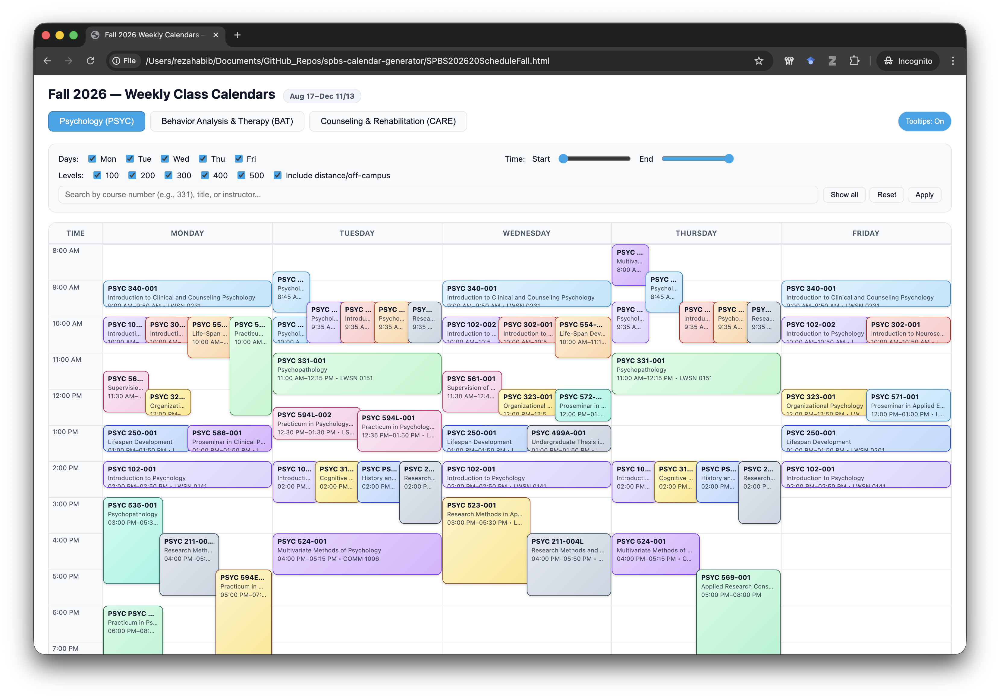
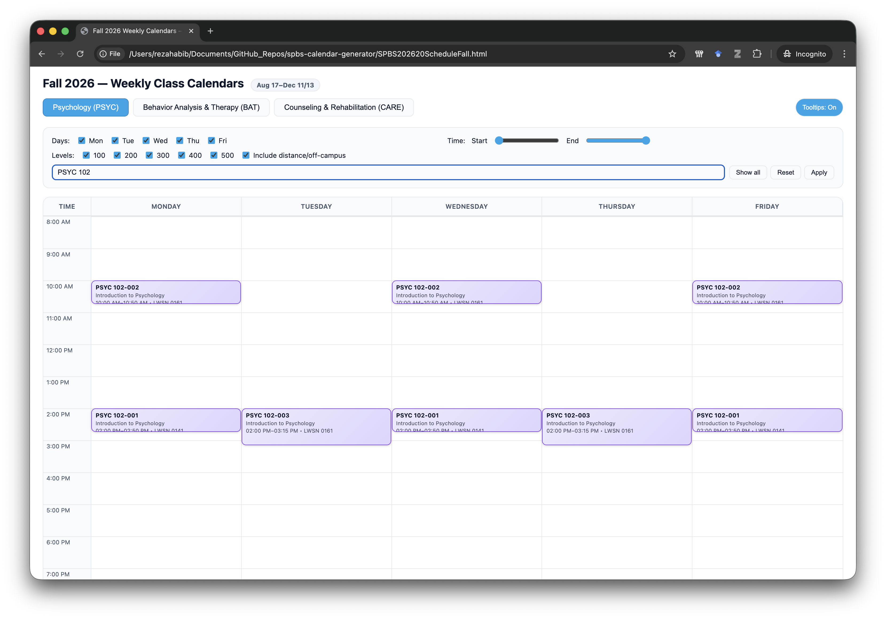
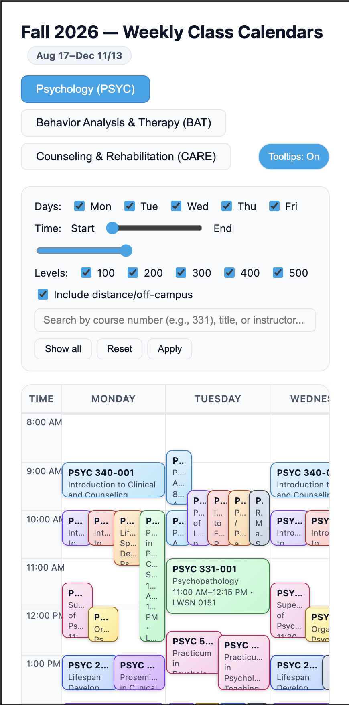
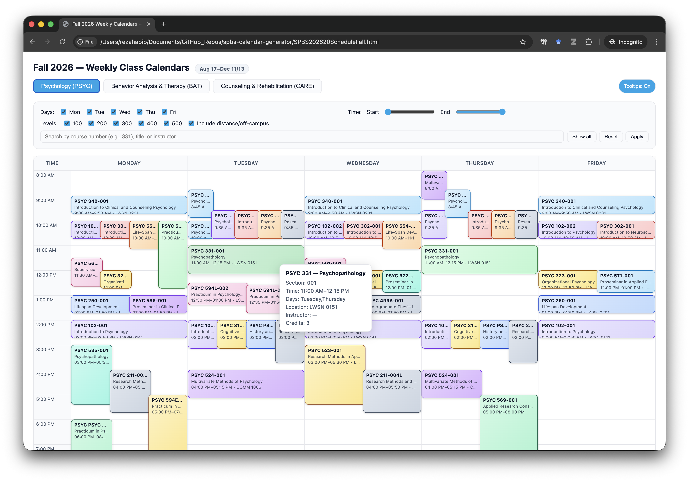

# SPBS Course Calendar Generator

**Automated pipeline transforming Banner SIS data into interactive HTML schedules**

[](https://www.python.org/)
[](https://www.oracle.com/database/)
[](LICENSE)

---

## Overview

An end-to-end automation solution that connects directly to Banner (Ellucian) Oracle databases, extracts course scheduling data, and generates responsive, interactive HTML calendars. Built to solve real scheduling visibility challenges for the School of Psychological and Behavioral Sciences (SPBS) at Southern Illinois University.

**One command. Zero manual work. Real-time accuracy.**

```bash
python3 generate_calendar.py 202660
```


*Interactive calendar with real-time filtering, responsive grid layout, and course details*

---

## The Problem

Academic departments face recurring challenges with course schedule visibility:
- **Manual processes**: Staff manually copy/paste data from Banner into spreadsheets or static PDFs
- **Outdated information**: Schedules become stale as courses are added, modified, or cancelled
- **Poor UX**: Static formats don't allow filtering by instructor, time, or course type
- **Repeated work**: Process must be repeated every semester

For SPBS with 400+ students and 50+ course sections per term, this represented significant administrative overhead and student frustration.

---

## The Solution

A fully automated pipeline that:

1. **Connects directly to Banner Oracle database** using institutional credentials
2. **Executes optimized SQL queries** to extract course offerings, meeting times, and instructor data
3. **Applies business rules** including cross-listing consolidation and section filtering
4. **Generates interactive HTML** with responsive design and real-time client-side filtering
5. **Runs in seconds** with a single command

### Key Features

✅ **Zero-infrastructure requirement** - Pure Python + static HTML, no web server needed  
✅ **Real-time filtering** - Filter by subject, instructor, time, or search keywords  
✅ **Responsive design** - Works seamlessly on desktop, tablet, and mobile  
✅ **Smart consolidation** - Automatically merges cross-listed courses and lecture/lab sections  
✅ **Accessible** - Clean grid layout with visual time-alignment and hover interactions  
✅ **Portable** - Single HTML file can be emailed, posted to websites, or shared via learning management systems

---

## Technical Architecture

### Stack
- **Backend**: Python 3.8+ with `oracledb` for Oracle connectivity
- **Database**: Banner (Ellucian) Oracle 19c via ODSMGR schema
- **Frontend**: Vanilla HTML5, CSS3, JavaScript (no frameworks)
- **Data Flow**: SQL → Python → JSON → HTML

### Pipeline Stages

```
┌─────────────┐      ┌──────────────┐      ┌─────────────┐      ┌──────────────┐
│   Banner    │─────>│    Python    │─────>│    JSON     │─────>│  Interactive │
│  Oracle DB  │ SQL  │  Data Parser │ ETL  │ Intermediate│ Build│     HTML     │
└─────────────┘      └──────────────┘      └─────────────┘      └──────────────┘
```

**Key Technical Decisions:**
- **Direct database access** rather than CSV exports eliminates manual steps
- **Client-side rendering** means no server infrastructure or maintenance
- **Single-file output** maximizes portability and simplifies deployment
- **Modular architecture** allows independent testing of query, parsing, and rendering layers

---

## Screenshots

### Main Calendar View

*Three-tab interface for PSYC, BAT, and CARE courses with unified filtering*

### Filtering & Search

*Real-time filtering by instructor, course level, time of day, or keyword search*

### Mobile Responsive

*Fully responsive design adapts to any screen size*

### Course Details

*Hover for detailed course information including CRN, location, and enrollment*

---

## Installation & Setup

### Prerequisites
- Python 3.8 or higher
- Access to Banner Oracle database with read permissions on ODSMGR schema
- Network access to database (VPN if required)

### Step 1: Clone Repository
```bash
git clone https://github.com/rezahabib/spbs-calendar-generator.git
cd spbs-calendar-generator
```

### Step 2: Install Dependencies
```bash
pip install oracledb
```

### Step 3: Configure Database Credentials
```bash
# Copy template
cp banner_config_template.py banner_config.py

# Edit with your credentials
nano banner_config.py
```

Add your actual Banner connection details:
```python
BANNER_USER = 'your_username'
BANNER_PASSWORD = 'your_password'
BANNER_HOST = 'your-banner-host.edu'
BANNER_PORT = '1521'
BANNER_SERVICE = 'PROD'
```

**Security Note**: `banner_config.py` is in `.gitignore` and will never be committed to version control.

### Step 4: Generate Calendar
```bash
# For Fall 2026
python3 generate_calendar.py 202660

# For Spring 2026
python3 generate_calendar.py 202620

# For Summer 2026
python3 generate_calendar.py 202640
```

Output: `SPBS202620ScheduleFall.html` (or appropriate term)

---

## Usage

### Term Code Format
Banner term codes follow the pattern `YYYYTT`:
- **YYYY** = Academic year
- **TT** = Term type:
  - `20` = Spring
  - `40` = Summer  
  - `60` = Fall

**Examples:**
- Spring 2026: `202620`
- Fall 2026: `202660`
- Spring 2027: `202720`

### Running for Different Terms
```bash
# Generate Spring 2027 calendar
python3 generate_calendar.py 202720

# Generate Summer 2026 calendar
python3 generate_calendar.py 202640
```

### Customization

The pipeline applies SPBS-specific business rules, but can be adapted for other departments:

1. **Subject codes** - Edit the SQL query in `generate_calendar.py` (line 55):
   ```sql
   AND (so.SUBJECT = 'PSYC' OR so.SUBJECT = 'BAT' OR so.SUBJECT = 'CARE')
   ```

2. **Filtering rules** - Modify `should_include()` function to change section exclusions

3. **Tab structure** - Update HTML generation to change subject groupings

4. **Styling** - Customize CSS in the HTML template for branding

---

## Business Rules & Data Processing

### Course Filtering
- **Excludes**: Sections 700-799 (except BAT 595-713)
- **Excludes**: Online asynchronous courses (no meeting times)
- **Excludes**: Cancelled or inactive sections

### Special Handling

**PSYC 211 Consolidation:**
- Combines 4 lecture sections (001-004) into single display box
- Shows individual lab sections (001L-004L) separately
- Preserves accurate meeting times for each component

**Cross-Listed Courses:**
- Merges duplicate offerings (e.g., PSYC 524 = BAT 524)
- Displays both course codes in single calendar box
- Prevents scheduling conflicts from appearing twice

**Location Anonymization:**
- Removes building/room for specific online sections (e.g., PSYC 569)
- Applies institution-specific privacy rules

### Data Quality Handling
- Gracefully handles NULL values in day indicators
- Validates meeting times before display
- Defaults missing instructor names to empty string
- Preserves complete data in JSON intermediate format

---

## Project Structure

```
spbs-calendar-generator/
├── README.md                           # This file
├── LICENSE                             # MIT License
├── .gitignore                          # Excludes credentials and outputs
│
├── generate_calendar.py                # ⭐ MAIN SCRIPT - Run this!
├── banner_config_template.py           # Template for database credentials
├── banner_config.py                    # Your actual credentials (not in git)
│
├── generate_calendar_from_banner.py    # Standalone Banner query script
├── build_spbs_calendar.py              # Standalone HTML builder
├── parse_banner_csv.py                 # Alternative: CSV import workflow
├── generate_spbs_calendar.py           # Legacy wrapper script
│
├── Course_Schedule_for_Calendar.sql    # SQL query for DBeaver/direct use
│
└── screenshots/                        # Demo images
    ├── calendar-main.png
    ├── calendar-filters.png
    ├── calendar-mobile.png
    └── calendar-tooltip.png
```

---

## Performance

**Query Execution:**
- ~1-2 seconds to query 150-200 course sections from Banner
- Sub-second parsing and filtering
- ~0.5 seconds to generate 50KB HTML file

**Total Runtime:** < 5 seconds from command to finished calendar

**Scale:** Tested with 170 database rows producing 56 filtered courses. Linear performance scaling expected up to 500+ courses per term.

---

## Institutional Impact

**Before Implementation:**
- 2-3 hours manual data entry per semester
- Schedules outdated within days of publication
- Students emailed advisors for schedule conflicts
- No mobile access to course times

**After Implementation:**
- < 5 seconds to regenerate current schedule
- One-click refresh as courses change
- Self-service filtering reduces advising load
- 100% mobile-responsive access

**Potential Expansion:**
- Extend to all 23 SPBS faculty courses
- Deploy across multiple departments
- Integrate with university website CMS
- Add API endpoint for programmatic access

---

## Alternative Workflows

### CSV Export Method
If direct database access is unavailable:

1. Export schedule from Banner SSB as CSV
2. Use `parse_banner_csv.py` instead:
   ```bash
   python3 parse_banner_csv.py SCHEDULE_OFFERING_MEETING_TIME.csv
   python3 build_spbs_calendar.py
   ```

### Manual SQL Query
For ad-hoc queries in DBeaver or SQL*Plus:
```bash
# Use the provided SQL file
sqlplus username/password@database @Course_Schedule_for_Calendar.sql
```

---

## Skills Demonstrated

### Technical
- **Database Engineering**: Complex SQL joins, Oracle-specific syntax, performance optimization
- **Python Development**: ETL pipelines, data parsing, file I/O, error handling
- **Web Development**: Responsive CSS Grid, vanilla JavaScript, accessibility best practices
- **DevOps**: Credential management, environment configuration, deployment planning

### Institutional
- **SIS Expertise**: Deep knowledge of Banner data structures and Ellucian ecosystem
- **Business Analysis**: Translated faculty needs into technical requirements
- **Process Improvement**: Identified automation opportunity, quantified impact
- **Stakeholder Communication**: Balanced technical accuracy with user experience

---

## Future Enhancements

- [ ] **Automated scheduling** - Cron job to regenerate calendar nightly
- [ ] **Email notifications** - Alert faculty when their courses change
- [ ] **iCal export** - Allow students to import schedules to personal calendars
- [ ] **Conflict detection** - Highlight overlapping course times
- [ ] **Historical archives** - Track schedule changes over time
- [ ] **Multi-term view** - Display Fall/Spring side-by-side
- [ ] **Room utilization** - Analyze building/classroom usage patterns
- [ ] **API endpoint** - RESTful API for programmatic access

---

## About the Author

**Reza Habib, PhD**  
Associate Professor & Director, School of Psychological and Behavioral Sciences  
Southern Illinois University Carbondale

- 📧 Email: [reza.habib@gmail.edu](mailto:reza.habib@gmail.edu)
- 💼 LinkedIn: [linkedin.com/in/reza-habib](https://linkedin.com/in/reza-habib)
- 🔗 Portfolio: [github.com/rezahabib](https://github.com/rezahabib)

**Background:**
- 22 years in higher education administration
- PhD in Psychology (University of Toronto)
- Director-level experience managing 400+ students, 23 faculty, $2M budget
- Expertise in institutional research, assessment, and data-driven decision making
- 50+ peer-reviewed publications in cognitive psychology and neuroscience

This project represents the intersection of institutional knowledge and technical implementation—understanding both what data exists in Banner and how to make it actionable for faculty and students.

---

## License

MIT License - See [LICENSE](LICENSE) file for details.

---

## Contributing

This is a portfolio project, but suggestions and improvements are welcome! Feel free to:
- Open an issue for bugs or feature requests
- Fork the repo and submit pull requests
- Adapt the code for your own institution (please credit original work)

---

## Acknowledgments

- Southern Illinois University IT for database access and support
- SPBS faculty for feedback on schedule visibility needs
- Ellucian Banner team for comprehensive documentation

---

**Built with ❤️ and Python to solve real institutional challenges**
